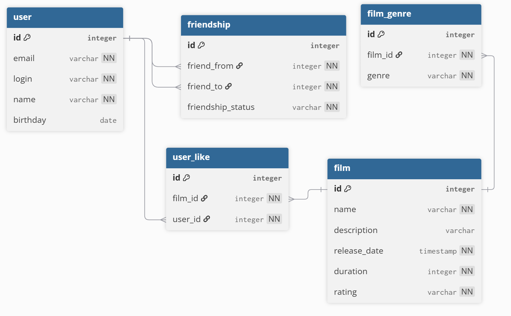

# java-filmorate
Template repository for Filmorate project.

Диаграмма БД


### Примеры запросов

```sql
SELECT * FROM user WHERE id = ?;
```

```sql
SELECT * FROM film;
```

```sql
SELECT user_id FROM user_like WHERE film_id = ?;
```

```sql
INSERT INTO user_like (film_id, user_id) VALUES (?, ?);
```

```sql
INSERT INTO friendship (friend_from, friend_to, friendship_status)
VALUES (?, ?, 'UNCONFIRMED');
```

```SQL
UPDATE friendship
SET friendship_status = 'CONFIRMED'
WHERE friend_from = ? AND friend_to = ?;
```