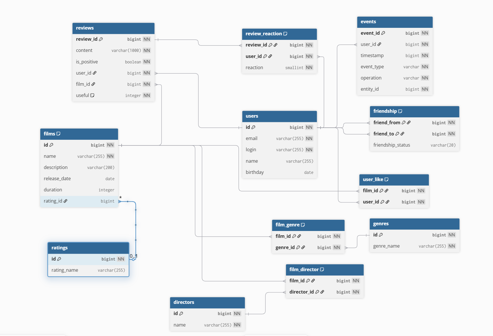

# Проект Java-Filmorate. Спринт 13, групповая работа. 1 команда.

## Функциональность «Отзывы» (Ф‑1)

Добавлена функциональность отзывов (reviews) с поддержкой лайков и дизлайков.

**Что реализовано:**

* CRUD‑операции для отзывов (создание, обновление, удаление, получение);
* добавление и удаление реакций (лайк / дизлайк);
* пересчёт рейтинга полезности ($\text{useful} =$ сумма реакций);
* сортировка отзывов по полезности (`ORDER BY useful DESC`);
* поддержка получения отзывов:
    * всех отзывов;
    * отзывов по конкретному фильму;
* ограничение количества отзывов (`limit`).

**База данных:**

* добавлены таблицы `reviews` и `review_reaction`;
* настроены внешние ключи и каскадное удаление;
* обновлён `schema.sql`.

**Тестирование:**

* реализованы интеграционные тесты `ReviewRepositoryTest`;
* реализованы тесты бизнес‑логики `ReviewServiceTest`;
* проверены сценарии:
    * создание, обновление, удаление отзывов;
    * добавление / удаление лайков и дизлайков;
    * замена реакции;
    * корректный пересчёт `useful`;
    * обработка ошибок (пользователь / фильм / отзыв не найден).

**Прочее:**

* методы реакций переведены с `boolean` на `void`.

## Функциональность «Поиск» (Ф‑2)

Добавлена функциональность «Поиск».

**Что реализовано:**

* операция поиска фильмов по части наименования фильма и/или по части имени режиссёра.

**База данных:**

* без изменений.

**Тестирование:**

* добавлены тесты `FilmRepository`.

## Функциональность «Общие фильмы» (Ф‑3)

Добавлена функциональность «Общие фильмы» (Ф‑3).

**Что реализовано:**

* Добавлен эндпоинт: `GET /films/common?userId={userId}&friendId={friendId}`
* Реализована логика получения фильмов, которые лайкнули оба пользователя.
* Добавлена сортировка по популярности (количество лайков).

**Service:**

* Добавлен метод `getCommonFilms(userId, friendId)`.
* Добавлена проверка существования пользователей.

**Repository:**

* Реализован SQL‑запрос для получения общих фильмов.
* Добавлена сортировка по количеству лайков (`DESC`).

**Controller:**

* Добавлен новый endpoint `/films/common`.

**База данных:**

* без изменений.

**Тестирование:**

* Добавлены тесты:
    * `FilmRepositoryCommonFilmsTest`;
    * `FilmServiceCommonFilmsTest`.
* Проверены сценарии:
    * получение только общих фильмов;
    * корректная сортировка по популярности;
    * ошибки при несуществующих пользователях.


## Функциональность «Рекомендации» (Ф‑4)

Добавлена функциональность «Рекомендации».

**Что реализовано:**

* добавлен эндпоинт `GET /users/{id}/recommendations`

**База данных:**

* без изменений.

**Тестирование:**

* добавлены тесты  в `FilmRepository`.


## Функциональность «Лента событий» (Ф‑5)

Добавлена функциональность «Лента событий».

**Что реализовано:**

* операция добавления событий:
    * добавление/удаление лайка;
    * добавления/удаления друга;
    * добавления/изменения/удаления отзыва;
    * операция получения всей ленты событий указанного пользователя.

**База данных:**

* добавлена таблица events

**Тестирование:**

* добавлены тесты FeedRepository.

## Функциональность «Удаление фильмов и пользователей» (Ф‑6)

Добавлена функциональность «Удаление фильмов и пользователей».

**Что реализовано:**

* добавлен эндпоинт `DELETE /users/{userId}` для удаления пользователя по идентификатору
* добавлен эндпоинт `DELETE /films/{filmId}` для удаления фильма по идентификатору

**База данных:**

* без изменений.

**Тестирование:**

* добавлены тесты в `FilmRepository` и `UserRepository`.


## Функциональность «Фильмы по режиссерам» (Ф‑7)

Добавлена функциональность «Фильмы по режиссёрам».

**Что реализовано:**

* CRUD операции для режиссера
* Добавление режиссера в фильм
* получение всех фильмов режиссера с сортировкой (year, likes)

Изменено:
* У фильма может быть несколько режиссеров
* CRUD для режиссеров в сущность фильм

**База данных:**
* Добавлены таблицы `directors` и `film_director`
* Настроены внешние ключи и каскадное удаление
* Обновлён schema.sql

**Тестирование:**
* Интеграционные тесты для `DirectorRepository`
* Тесты `DirectorService`
* добавлены тесты для `FilmRepository`, `FilmService`

## Функциональность «Популярные фильмы» (Ф‑8)

Добавлена функциональность «Популярные фильмы», которая выводит топ-N фильмов по количеству лайков.

**Что реализовано:**

Фильтрация по двум параметрам:
* По жанру.
* За указанный год.

Добавлен эндпоинт `GET /films/popular?count={limit}&genreId={genreId}&year={year}`

**База данных:**
без изменений

**Тестирование:**
Добавлены тесты для `FilmRepository`, `FilmService`.


## Диаграмма БД


### Примеры запросов

```sql
SELECT * FROM user WHERE id = ?;
```

```sql
SELECT * FROM film;
```

```sql
SELECT user_id FROM user_like WHERE film_id = ?;
```

```sql
INSERT INTO user_like (film_id, user_id) VALUES (?, ?);
```

```sql
INSERT INTO friendship (friend_from, friend_to, friendship_status)
VALUES (?, ?, 'UNCONFIRMED');
```

```SQL
UPDATE friendship
SET friendship_status = 'CONFIRMED'
WHERE friend_from = ? AND friend_to = ?;
```